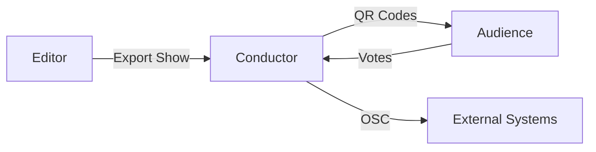
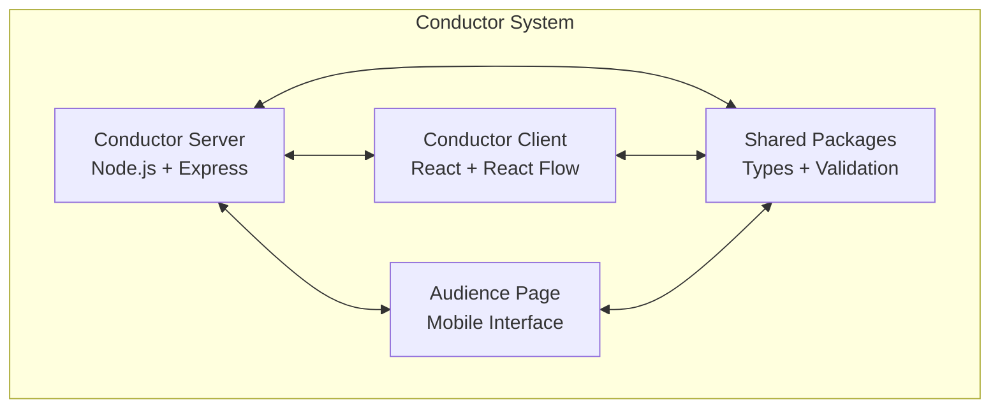

<div align="center">

# MEANDER
## Interactive Theatrical Choose-Your-Own-Adventure Platform

[](https://www.typescriptlang.org/)
[](https://reactjs.org/)
[](https://nodejs.org/)
[](https://opensource.org/licenses/MIT)

*Where every performance is unique, and every audience shapes the story.*

[Quick Start](#quick-start) • [Documentation](#platform-overview) • [Editor](#editor) • [Conductor](#conductor) • [Audience](#audience)

</div>

---

MEANDER is a complete platform for creating and performing interactive theatrical experiences where audiences vote to determine the story's direction in real-time. The system consists of three main components working together to create immersive, participatory performances.

> **Perfect for**: Interactive theater, immersive experiences, educational storytelling, and participatory performances

## Platform Overview

MEANDER enables creators to build branching narratives where audience members use their mobile devices to vote on story choices, creating unique performances that unfold differently each time. The platform is designed for local network deployment, ensuring reliable performance without internet dependency.

### Core Components

<table align="center">
<tr>
<td align="center" width="33%">

**EDITOR**  
*Visual Story Creation*

- Node-based editor
- Media integration
- Package export
- Real-time validation

</td>
<td align="center" width="33%">

**CONDUCTOR**  
*Runtime Engine & Control*

- Show execution
- Vote management
- OSC broadcasting
- QR code generation

</td>
<td align="center" width="33%">

**AUDIENCE**  
*Mobile Voting Interface*

- QR code access
- Fullscreen media
- Real-time voting
- Mobile optimized

</td>
</tr>
</table>



---

## Editor
**Visual Story Creation & Show Design**

> **Purpose**: Create interactive theatrical experiences with visual node-based editing

The Editor is a powerful visual tool for creating interactive theatrical experiences. Design branching narratives, upload media, and export complete show packages ready for performance.

### Key Features

| Feature | Description |
|---------|-------------|
| **Visual Node Editor** | Drag-and-drop interface for intuitive story creation |
| **Multiple Node Types** | Scenes, Forks, Opening, and Ending nodes |
| **Media Integration** | Upload images and videos for audience displays |
| **Real-time Validation** | Ensures story structure integrity |
| **Package Export** | Creates self-contained ZIP files with all assets |

### Node Types

<div align="center">

| Node Type | Description | Connections |
|-----------|-------------|-------------|
| **Opening Scene** | Story starting point | No inputs, 1 output |
| **Regular Scene** | Main story content | 1 input, 1 output |
| **Fork/Choice** | Audience voting points | 1 input, multiple outputs |
| **Ending Scene** | Story conclusion | 1 input, no outputs |

</div>

### Setup Guide

<details>
<summary><b>Prerequisites</b></summary>

- **Node.js**: Version 18 or higher
- **Package Manager**: npm or yarn
- **Browser**: Modern browser with ES2020 support

</details>

<details>
<summary><b>Installation & Development</b></summary>

```bash
# Navigate to Editor directory
cd Editor

# Install dependencies
npm install

# Start development server
npm run dev
# Opens at http://localhost:5173
```

</details>

<details>
<summary><b>Production Build</b></summary>

```bash
# Build for production
npm run build

# Preview production build
npm run preview
```

</details>

<details>
<summary><b>Usage Workflow</b></summary>

1. **Create New Show**: Opening scene added automatically
2. **Add Content**: Type descriptions - nodes resize automatically  
3. **Create Branches**: Use Fork nodes, add choices, connect to scenes
4. **Add Media**: Upload images/videos for audience displays
5. **Validate**: Check story structure with built-in validator
6. **Export**: Download complete show package (ZIP file)

</details>

---

## Conductor
**Runtime Engine & Performance Control**

> **Purpose**: Manage live performances with real-time audience interaction and external system integration

The Conductor manages live performances, handling show execution, audience voting, and external system integration. It consists of a server (runtime engine) and client (operator interface).

### Key Features

<div align="center">

| Feature | Description | Technology |
|---------|-------------|------------|
| **Show Execution** | Loads and runs show packages from Editor | Node.js + Express |
| **Audience Voting** | Real-time vote collection and processing | WebSocket + REST API |
| **OSC Broadcasting** | Integration with lighting, sound, and other systems | UDP + OSC protocol |
| **Visual Control** | Node graph interface matching Editor design | React + React Flow |
| **QR Code Generation** | Easy audience access via mobile devices | QRCode library |
| **State Management** | Persistent show state with error recovery | LevelDB |

</div>

### Architecture



### Setup Guide

<details>
<summary><b>Prerequisites</b></summary>

- **Node.js**: Version 18 or higher
- **pnpm**: Version 8.6.10+ (`npm install -g pnpm`)
- **Network**: Local network access for audience devices

</details>

<details>
<summary><b>Installation & Development</b></summary>

```bash
# Navigate to Conductor directory
cd Conductor

# Install dependencies
pnpm install

# Start both server and client
pnpm run conductor

# Or start individually
pnpm run conductor:server  # Server on :4000
pnpm run conductor:client  # Client on :5173
```

</details>

<details>
<summary><b>Production Build</b></summary>

```bash
# Build all packages
pnpm run build

# Start production server
pnpm run start
```

</details>

<details>
<summary><b>Usage Workflow</b></summary>

1. **Load Show**: Upload ZIP package exported from Editor
2. **Monitor Progress**: View show state in visual node graph
3. **Control Performance**: Use Advance button to progress story
4. **Manage Voting**: Monitor audience votes and countdown timers
5. **Access QR Codes**: Click "QR Codes" button for audience access
6. **OSC Integration**: Connect to lighting/sound systems via UDP

</details>

<details>
<summary><b>Network Configuration</b></summary>

| Service | Port | Protocol | Purpose |
|---------|------|----------|---------|
| **Server** | 4000 | HTTP/WebSocket | Audience voting & API |
| **OSC** | 57121 | UDP | External system integration |
| **Network** | 0.0.0.0 | All interfaces | Local network access |
| **QR Codes** | Auto | HTTP | Mobile device access |

</details>

---

## Audience
**Mobile Voting Interface**

> **Purpose**: Enable audience participation through mobile devices with real-time voting and media display

The Audience component provides a mobile-optimized interface for audience members to participate in the interactive performance. Accessible via QR codes, it displays media and collects votes in real-time.

### Key Features

<div align="center">

| Feature | Description | Benefit |
|---------|-------------|---------|
| **QR Code Access** | Easy mobile device connection | No typing URLs |
| **Fullscreen Media** | Images and videos with smooth transitions | Immersive experience |
| **Real-time Voting** | Interactive choice selection with countdown timers | Engaging participation |
| **Mobile Optimized** | Responsive design for all screen sizes | Universal compatibility |
| **Auto-reconnection** | Robust WebSocket connection handling | Reliable performance |
| **Accessibility** | Screen reader support and keyboard navigation | Inclusive design |

</div>

### Setup Guide

<details>
<summary><b>Prerequisites</b></summary>

- Running Conductor Server
- Mobile devices on same local network
- Network connectivity between devices

</details>

<details>
<summary><b>Access Methods</b></summary>

| Method | URL | Use Case |
|--------|-----|----------|
| **QR Code** | Scan from Conductor UI | Easiest for audience |
| **Direct URL** | `http://[server-ip]:4000/audience-page` | Manual entry |
| **QR Page** | `http://[server-ip]:4000/QR` | Display all QR codes |

</details>

<details>
<summary><b>Development</b></summary>

```bash
cd Conductor
pnpm run conductor:audience
# Audience page on :3001 (dev mode)
```

</details>

<details>
<summary><b>Usage Workflow</b></summary>

1. **Connect**: Scan QR code or visit URL
2. **View Media**: Fullscreen images/videos during scenes
3. **Vote**: Select choices during fork moments
4. **Countdown**: Automatic vote submission when timer expires
5. **Reconnect**: Automatic reconnection if connection lost

</details>

---

## Performer (Coming Soon)
**Specialized Performer Interface**

The Performer component will provide a specialized interface for performers with access to vote results, performance cues, and backstage information.

### Planned Features
- **Vote Results**: Real-time access to audience voting data
- **Performance Cues**: Visual/audio cues based on story progression
- **Backstage Info**: Performer-specific information and notes
- **Timing Information**: Scene duration and transition cues

### Setup Guide
*Coming soon - placeholder route available at `/performer-page`*

---

## Quick Start

### Complete Setup (All Components)

1. **Clone Repository**
   ```bash
   git clone <repository-url>
   cd Meander
   ```

2. **Setup Editor**
   ```bash
   cd Editor
   npm install
   npm run dev
   # Create your show at http://localhost:5173
   ```

3. **Setup Conductor**
   ```bash
   cd Conductor
   pnpm install
   pnpm run conductor
   # Server: http://localhost:4000
   # Client: http://localhost:5173
   ```

4. **Load Show**
   - Export show from Editor
   - Upload ZIP file in Conductor Client
   - Click "QR Codes" for audience access

5. **Audience Access**
   - Scan QR code with mobile device
   - Ensure device is on same network
   - Start voting and enjoying the show!

---

## Network Architecture

MEANDER is designed for **local network deployment** during performances:

```
┌─────────────────────────────────────────────────────────────┐
│                    Local Network                            │
│                                                             │
│  ┌─────────────┐    ┌─────────────┐    ┌─────────────┐     │
│  │   Laptop    │    │   Router    │    │   Mobile    │     │
│  │ (Conductor) │◀──▶│   (WiFi)    │◀──▶│  Devices    │     │
│  │             │    │             │    │ (Audience)  │     │
│  │ :4000 HTTP  │    │             │    │             │     │
│  │ :4000 WS    │    │             │    │             │     │
│  │ :57121 OSC  │    │             │    │             │     │
│  └─────────────┘    └─────────────┘    └─────────────┘     │
└─────────────────────────────────────────────────────────────┘
```

### Network Requirements
- **TCP Port 4000**: HTTP/WebSocket (audience voting)
- **UDP Port 57121**: OSC (external systems)
- **Local Network**: All devices on same subnet
- **No Internet**: Performance works offline

---

## Testing

### End-to-End Tests
```bash
cd Conductor
pnpm run test:e2e
```

### Test Coverage
- **Conductor UI**: Basic functionality and show management
- **Audience Voting**: Mobile interface and voting interactions
- **Full Journey**: Complete show execution workflow
- **Mobile Responsive**: Cross-device compatibility

---

## Project Structure

```
Meander/
├── Editor/                 # Visual story creation tool
│   ├── src/               # React components and logic
│   ├── packages/          # Shared utilities
│   └── dist/              # Built application
├── Conductor/             # Runtime engine and control
│   ├── packages/
│   │   ├── conductor-server/    # Node.js backend
│   │   ├── conductor-client/    # React operator UI
│   │   ├── audience-page/       # Mobile voting interface
│   │   ├── conductor-types/     # Shared TypeScript types
│   │   └── shared-export-loader/ # Package utilities
│   ├── tests/             # End-to-end tests
│   └── dist/              # Built applications
└── packages/              # Legacy shared packages
```

---

## Development

### Technology Stack
- **Frontend**: React, TypeScript, Vite
- **Backend**: Node.js, Express, WebSocket
- **Database**: LevelDB (embedded)
- **Testing**: Playwright
- **Package Management**: pnpm workspaces
- **Build Tools**: TypeScript, Vite, tsup

### Code Style
- **TypeScript**: Complete type safety throughout
- **ESLint**: Consistent code formatting
- **Prettier**: Code style enforcement
- **Husky**: Pre-commit hooks

---

## License

This project is licensed under the MIT License - see the LICENSE file for details.

---

## Contributing

Contributions are welcome! Please see our contributing guidelines for details on:
- Code style and standards
- Testing requirements
- Pull request process
- Issue reporting

---

## Support

For support, questions, or feature requests:
- **Issues**: GitHub Issues
- **Documentation**: Component-specific READMEs
- **Community**: [Contact information]

---

**Built for theatrical innovation and interactive storytelling**

*MEANDER - Where every performance is unique, and every audience shapes the story.*
